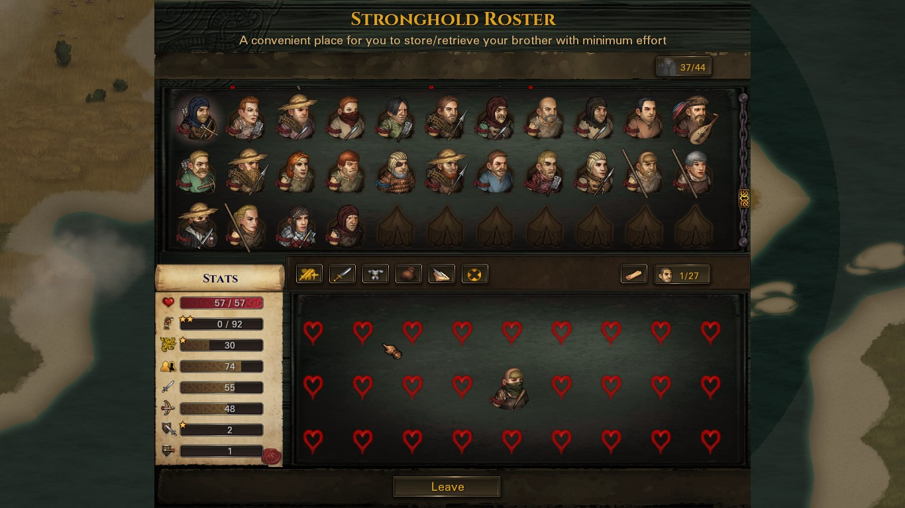
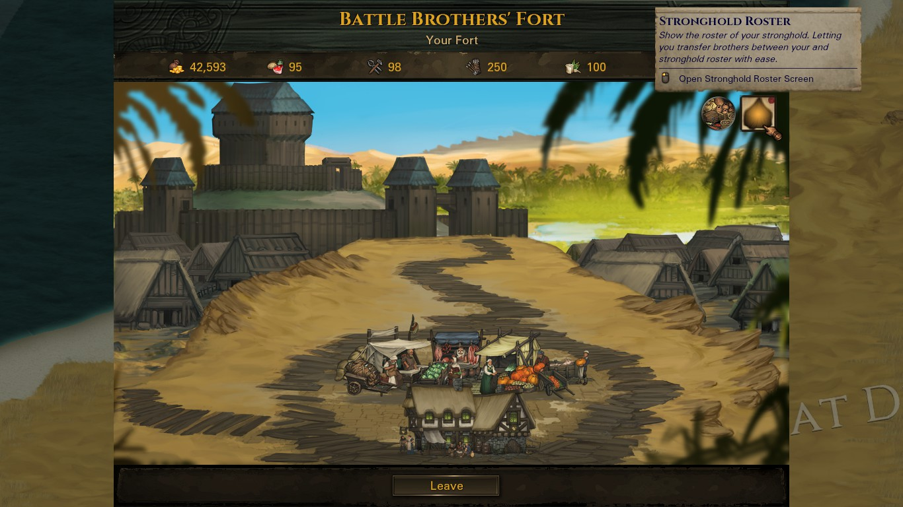

# UI-Stronghold-Roster-Add-On
A mod of Battle Brother, a submod of Stronghold mod, to add a new UI

## Description
Stronghold is a great mod but one thing has been bugging me. It's the way you store/retrieve brother from stronghold, i'm not a fan of that text based UI so i made this mod to improve your experience using stronghold roster.

Here is what you can expect to see with the new UI:
1. Easier to store/retrieve brother from stronghold roster
2. Allow you to rename any brother
3. Dismiss brother in stronghold roster
4. Checking perk tree of selected brother
5. Visible stats/talents/skills of selected brother
6. Stripping arms, armors, bag items or all equipment from selected brother
7. Allow you to store up to 165 brothers in stronghold

# Note:
This mod is originally made for Stronghold mod with Legends mod installed, which is the recommend set up. I haven't tested it with no Legends mod installed game, i can forsee this mod can create a exploit allows vanilla game to have more brothers in battle than the limit.

## Requirements
* Battle Brothers, version 1.4.0.49 or newer
* Modding Script Hooks, version 19.0 or newer [link](https://www.nexusmods.com/battlebrothers/mods/42)
* Mod Stronghold, version 1.2 or newer, [link](https://www.nexusmods.com/battlebrothers/mods/324)

## Usage
To install this mod you should do step-by-step:
1. Download and install the latest "Battle Brothers" game, you can buy the game on GOC or Steam.
2. Download the latest "Modding Script Hooks" mod.
3. Download the latest "Stronghold" mod.
4. Download the latest "UI Stronghold Roster Add-on" mod.
5. Put all the downloaded mods into the "data" directory of Battle Brothers (you should put zip without unzipping).
6. All done, now just run the game and find this icon to open the screen.

## License, Authors and Copyright

This repository is a mod for Battle Brothers game and as a submod for Stronghold made by TaroEld.

AUTHORS: NgGH707.

COPYRIGHT: Reprint or usage of materials/scripts from this repository is permitted only with the consent of the owner.

Battle Brothers content and materials are trademarks and copyrights of Overhype Studios or its licensors. All rights reserved. This mod project is not affiliated with Overhype Studios or its licensors.
